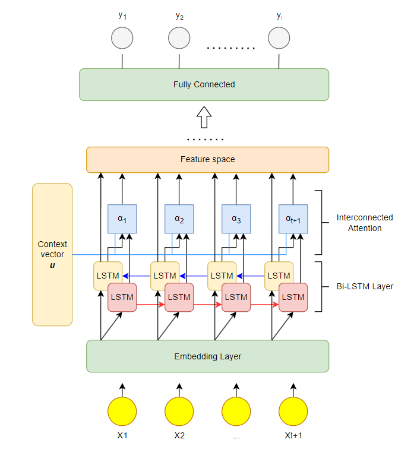
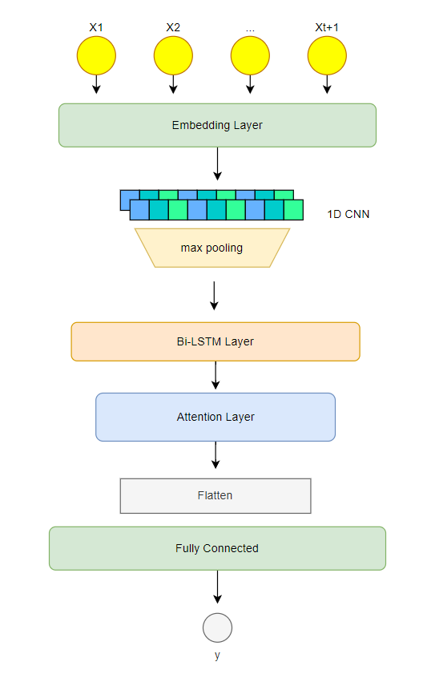
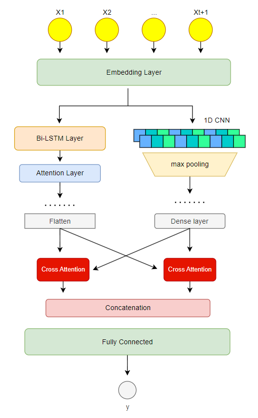
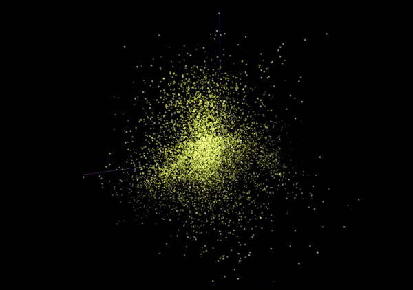
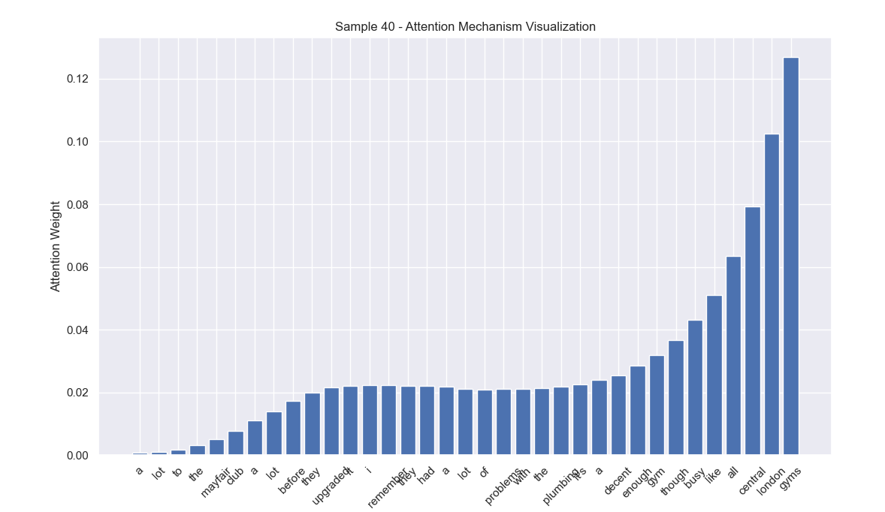
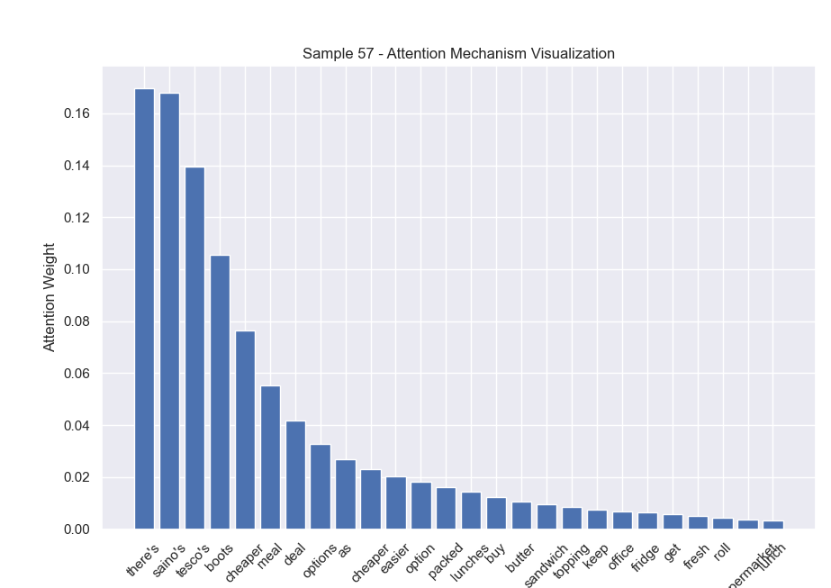
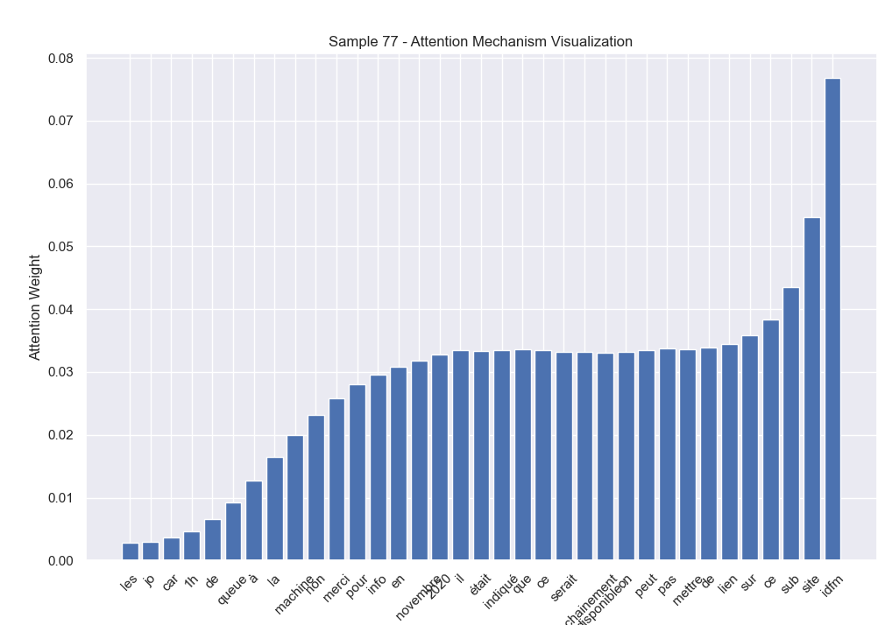
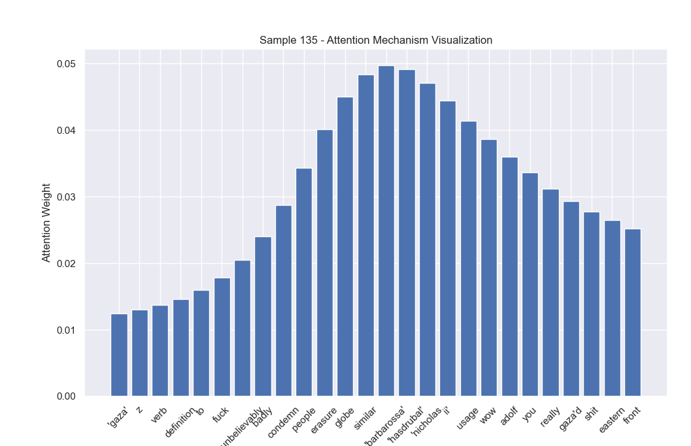

# Cross-Attention CNN-BiLSTM
<!-- /TOC -->
### Cross-Attention Bidirectional CNN-LSTM Network for text classification

#####  Base Contextual-Attention BiLSTM

##### Sequential CNN-LSTM

##### Parallel Cross-Attention CNN-LSTM

##### Word Embedding Space

### Visualized Attention weight map 

References: 

[LSTM with Attention by using Context Vector](https://github.com/gentaiscool/lstm-attention)

[Character-level Convolutional Networks for Text Classification](https://proceedings.neurips.cc/paper_files/paper/2015/file/250cf8b51c773f3f8dc8b4be867a9a02-Paper.pdf)
